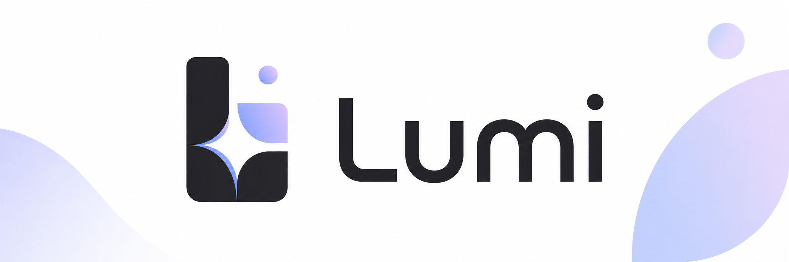

<p align="center">
  
</p>

<h1 align="center">Lumi</h1>

<p align="center">
  <strong>話して、覚えて、一緒に過ごす。デスクトップに住み着くAIキャラクター。</strong>
</p>

<p align="center">
  <a href="LICENSE"></a>
  <a href="https://github.com/taka2360/Lumi/releases/latest"></a>
  
  
  
</p>

<p align="center">
  <a href="README.md">English</a> ·
  <strong>日本語</strong>
</p>

> [!WARNING]
> **Lumi は開発中の早期のソフトウェアです。** Windows のみです。粗い部分と破壊的変更があります。
>
> **[最新リリース](https://github.com/taka2360/Lumi/releases/latest)は Phase 1 のビルド**です。
> → [インストール](#インストール) / [現在の進捗](#現在の進捗とロードマップ)

---

## Lumi とは

**「伺か」の系譜**にあるデスクトップ常駐キャラクター、アプリのウィンドウの中ではなく、
デスクトップそのものに住んでいるキャラクターを、現代のローカル AI スタック
（LLM / STT / TTS / Vision / ベクトル記憶）の上に作り直したものです。

「アバターを付けたチャット UI」ではなく、**PC という世界に住んでいる**ことを目指します。
こちらの声を聞き、こちらを覚えていて、今なにが起きているかを知っていて、ときどき自分から
話しかけてくる。

<!-- TODO: ここに 5〜15 秒のデモ GIF を置く。barge-in（喋っている Lumi を遮って、
     再生が単語の途中で止まる）が一番伝わる。assets/branding/demo.gif に置いて:
     <p align="center"></p> -->

### 主な差別化点

|  |  |  |
|---|---|---|
| 🗣️ | **完全なbarge-in** | 喋っている途中で遮れます。次の LLM トークンを待たず、音声経路の中でミュートします |
| 🧠 | **記憶** | 覚え、忘れ、矛盾を抱えられます。「前は逆のこと言ってたよね」 |
| 🛡️ | **安全な自律** | 自分から動きます。ただし副作用のある操作は必ず Permission Kernel を通り、**自分の権限確認 UI を自分で押すことはできません** |

### 「ローカル完結」の定義

|  | 定義 | Lumi |
|---|---|---|
| Air-gapped | ネットワークを一切使わない | ✗ |
| Local-first | 中核はローカル、外部は補助 | — |
| **Network-optional** | **外部通信は任意・明示的** | **✓** |

**推論・状態・判断はローカルで完結します。** 現在の会話機能では、セットアップさえ済めば会話中に
ネットワークは使いません。音声認識も言語モデルも音声合成も、すべて手元で動きます。
何かを取得するのはセットアップの1点だけで、そこでも**任意のコンポーネントを断りなく
取りに行くことはありません**。

将来クラウド LLM を使うとしても、それは「中核がクラウド化した」のではなく
「LLM Provider にネットワーク能力を明示的に与えた」として、同じ枠組みで扱います
（**Network-optional** は一般語ではなくこのプロジェクトの定義語です →
[DESIGN.md](docs/DESIGN.md) §1）。

---

## 構造

権威を明確に分けた3つのプロセスからなります。

```
+------------------ Lumi Shell (Tauri 2 / Rust) --------------------+
|  OS 特権プリミティブのみ。判断を持たない                            |
|  透過 / 最前面 / クリックスルー / ヒットテスト                      |
|  トレイ・ホットキー・スクリーンキャプチャ・入力インジェクション      |
|  Core サイドカーの起動と生存監視                                    |
|  Core からの os.* を認証・allowlist・schema 検証してから実行        |
|                                                                   |
|   +------ Stage WebView (React + TS + Zustand) ------+            |
|   |  表現のみ。ビジネスロジックを持たない              |            |
|   |  VRM 描画・表情・リップシンク・吹き出し            |            |
|   +--------------------------------------------------+            |
+-------------------------------------------------------------------+
                    | WebSocket (token 認証)
+------------------ Lumi Core (Python / asyncio) --------------------+
|  権威: 判断・状態・ポリシー・記憶。単一プロセス                      |
|  Attention Arbiter - Reactive Loop - Deliberative Loop            |
|  Memory - World State - Internal State                            |
|  Permission Kernel - Tool Registry - Event Bus                    |
|  Audio I/O (capture / VAD / playback / EchoGuard)                 |
+-------------------------------------------------------------------+
       | ext.* (capability-gated)     外部エンジン（所有しない）:
       v                              Ollama - AivisSpeech / VOICEVOX
   Sensor / Browser / GameAgent Extension
```


### 8つの Invariant

**これらは機能ではなく制約であり、実装のどの段階でも破りません。**

| # | 名前 | 守ること |
|---|---|---|
| 1 | **Authority** | 権限の最終決定者は Core Kernel だけ |
| 2 | **Tool Gate** | 副作用を持つ操作は例外なく Permission Kernel を通る |
| 3 | **Untrusted Data** | 外部由来のテキスト・画像・ファイル・Web・ゲーム画面は、**命令ではなくデータ** |
| 4 | **Attention** | foreground Activity は常にちょうど1つ |
| 5 | **Capability** | Extension の実効権限は `manifest ∩ policy ∩ user grant` |
| 6 | **No Hidden Authority** | Core が認識・監査できない状態変更を起こさない |
| 7 | **No Laundering** | いかなる自動処理も TrustLevel を下げない。要約も抽出も記憶化も汚染を除去しない |
| 8 | **Unautomatable Consent** | Lumi の権限確認 UI を Lumi 自身が操作できない |

全文と根拠 → [docs/contracts/invariants.md](docs/contracts/invariants.md)

### 技術スタック

| 領域 | 採用 |
|---|---|
| Desktop Shell | Tauri 2（`PlatformShell` で抽象化し Electron 退避路を確保） |
| AI Core | Python / asyncio、単一プロセス、**ハブ** |
| 音声 I/O | Core 内（barge-in critical path を Core に閉じる） |
| Memory | SQLite + sqlite-vec + FTS5。埋め込みは Harrier-OSS-v1 270M（ONNX q4 / 640 次元 / CPU） |
| LLM | Ollama（Qwen3系 / Gemma3系） |
| STT / VAD | faster-whisper (CTranslate2, int8) / Silero VAD (ONNX, CPU) |
| TTS | AivisSpeech / VOICEVOX（別プロセス。CUDA があれば GPU、無ければ CPU） |
| Character | VRM（[`@pixiv/three-vrm`](https://github.com/pixiv/three-vrm)）→ Live2D は Phase 9 で予定 |
| ライセンス | **Core = MIT。** GPL/AGPL・非 OSS を Core に入れない |

**Core は torch に依存しません**（インストーラサイズが追跡対象の制約であるため）。

会話由来のデータを持つ DB（記憶・イベント・監査ログ）は、DBファイルの各ページを ChaCha20 で暗号化します。
鍵は 256 bit で OS の秘密保管（Windows は DPAPI）に預け、ユーザーは
パスワードを作りません。**平文フォールバックはありません。** 守れるもの・守れないものは
[docs/contracts/privacy.md](docs/contracts/privacy.md) §3 に書いてあります。

これは `main` にある Phase 2 の話です。**現在のリリースは Phase 1** で、会話履歴をディスクに
残しておらず、イベント DB と監査 DB も暗号化されていません。

---

## 現在の進捗とロードマップ

**各 Phase は単体で使える製品であること。** Phase 1 で止めても「喋るデスクトップキャラ」として
成立します。

|  | Phase | 何を成立させるか | 状態 |
|---|---|---|---|
| **0** | Walking Skeleton | 透過・クリックスルー、サイドカーのパッケージング、初回セットアップ——賢さゼロで危険な統合点を先に貫通させる | ✅ 完了（2026-08-16） |
| **1** | MVP — 喋るデスクトップキャラ | Mic → VAD → STT → LLM → TTS → リップシンク、真の barge-in、Kernel 基盤 | ✅ 完了（2026-08-22） |
| **2** | Memory | 暗号化ストレージ、投機 STT、Episode と保持期間、ハイブリッド検索、Reflection、記憶 UI | 🟡 **進行中** — 実装は完了、実測が残っています。**まだリリースしていません** |
| **3** | World Model + Internal State + 自律（発話のみ） | Sensor、Drive、AutonomyGate と AutonomyBudget。**発話のみ。OS 操作はまだしない** | ⬜ 次 |
| **4a** | Kernel 本実装 + `fs` | Tool Registry、Canonicalizer、BindVerifier、権限プロンプト UI、監査ログ | ⬜ 予定 |
| **4b** | `browser` | Class B ツール、ResultVerifier、最小限のExtension基盤、out-of-process Browser Extension | ⬜ 予定 |
| **4c** | `computer` | screenshot + 入力インジェクション。Invariant 8 の穴の決着が前提 | ⬜ 予定 |
| **5** | Vision + Model Resource Manager | VRAM の admission 制御、LRU 退避、VLM のオンデマンドロード | ⬜ 予定 |
| **6** | Autonomous Life | Phase 3 × Phase 4——自律行動がツールを使えるようにする | ⬜ 予定 |
| **7** | Widget / Gamelet | Widget Broker、AI 生成ゲーム | ⬜ 予定 |
| **8** | Game Agent | 三層制御（Strategy / Tactics / Reflex）、GameAdapter | ⬜ 予定 |
| **9** | 第三者 Extension / Live2D | Extension SDK、manifest 署名、Live2D Renderer | ⬜ 予定 |

完了条件はベンチマークではなく「一緒に暮らせるか」で見ています。Phase 3 なら
**1日つけっぱなしにして不快でない**ことです。

### これまでの実測値

| | |
|---|---|
| 音声ターンのレイテンシ | **p50 1.50 秒 / ウォーム p95 1.63 秒**（SLO は p95 < 2.0 秒）。ただし **GPU 構成での話**で、CPU では TTS だけで 0.9 秒かかり届きません |
| インストーラサイズ | **87 MB**（v0.1.1）。半分ほどが STT/VAD の推論スタックと、同梱 VRM の 24 MB |
| アイドル時 VRAM | **55 MiB** |

レイテンシは録音済み音声のオフライン注入で測ったもので、実際に喋って測った値ではありません。
詳細と、何を保証しないかは以下のドキュメントにあります。 → [docs/measurements/](docs/measurements/)

### 意図的に作らないもの

クラウドサービス / マルチユーザー / アカウント / 課金 · Web版・モバイル版 ·
完全自律・無人運用 · 汎用エージェントフレームワーク · 学習・ファインチューニング基盤 ·
**実在の人物を演じる機能**（能力の不足ではなく、意図的な制約です）

### 影響を受けたもの

- **[Neuro-sama](https://www.twitch.tv/vedal987)** — 目指す体験。barge-in と記憶が
  「後で足す機能」ではなく最初の2本の柱になっているのは、ここから来ています
- **[Project AIRI](https://github.com/moeru-ai/airi)** — 参考実装として精読しました。
  設計思想は借りますが、コードは移植していません（→ [DESIGN.md](docs/DESIGN.md) §10）
- **[伺か](https://ja.wikipedia.org/wiki/伺か)** — 形式そのもの。
  アプリのウィンドウではなくデスクトップに住む、という発明

---

## インストール

**[最新リリース](https://github.com/taka2360/Lumi/releases/latest)** から
インストーラ（`Lumi_x.y.z_x64-setup.exe`）をどうぞ。Windows x64 のみです。

リリース版は **Phase 1** です。聞いて、考えて、喋って、途中で遮れますが、
**閉じると何も覚えていません**。記憶は `main` にあり、まだリリースに入っていません。

### 初回起動

会話には **TTS エンジン / LLM ランタイム / STT モデル**の3つが必要です。セットアップが順に
案内しますが、いずれも明示的な選択で、選ぶまで何も取得しません。

**断った場合、Lumi は「半分動く状態」では起動しません。** 不足している項目とその解決方法を
出して終了し、次回起動時に中断したところから再開します。キャラクターだけ立っていて実は
聞こえていない、という状態を作らないためです（→
[ADR-034](docs/decisions/ADR-034-gate-startup-on-complete-setup.md)）。

---

## ソースから動かす

**必要なもの** — Rust（MSVC ツールチェイン）· Node 24+ · pnpm 11 ·
[uv](https://docs.astral.sh/uv/)（Python 3.12 は uv が取得します）。Windows のみです。

```bash
git clone https://github.com/taka2360/Lumi.git
cd Lumi
pnpm install
cd core && uv sync && cd ..

pnpm dev            # アプリを起動（Shell + Stage、Core はサイドカー）
```

| 何を | コマンド | 場所 |
|---|---|---|
| アプリを起動 / インストーラを作る | `pnpm dev` · `pnpm build` | リポジトリ root |
| Core のセットアップ / 起動 / テスト | `uv sync` · `uv run lumi-core` · `uv run pytest` | `core/` |
| Core の lint / format / 型 | `uv run ruff check` · `uv run ruff format` · `uv run mypy` | `core/` |
| Stage のテスト / lint / 型 | `pnpm test` · `pnpm lint` · `pnpm typecheck` | `stage/` |
| Shell のテスト / lint / format | `cargo test` · `cargo clippy --all-targets -- -D warnings` · `cargo fmt` | `shell/src-tauri/` |

---

## リポジトリ構成とドキュメント

```
Lumi/
├── docs/          設計（唯一の正）。実装より先にここが変わる
├── core/          Lumi Core — Python / asyncio。権威（判断・状態・ポリシー・記憶）
├── shell/         Lumi Shell — Tauri 2 / Rust。OS 特権プリミティブのみ
├── stage/         Stage WebView — React + TS + Zustand。表現のみ
├── extensions/    〔Phase 5 で作る〕out-of-process Capability Extension
└── content/       Content Pack（キャラ・モデル・音声・人格。コードを含まない）
```

設計ドキュメントが唯一の正であり、コードより先に変わります。

| まずここから | |
|---|---|
| [docs/DESIGN.md](docs/DESIGN.md) | 設計憲法——目的・非目標・設計原則・全体アーキテクチャ |
| [docs/roadmap.md](docs/roadmap.md) | 何をいつ作るか。各 Phase の着手前に決めること |
| [docs/contracts/](docs/contracts/) | Invariant・セキュリティ境界・Provenance・Privacy（すべて Confirmed） |
| [docs/architecture/](docs/architecture/) | 領域ごとの設計: core / agent / memory / audio / autonomy / permission / ui |
| [docs/decisions/](docs/decisions/) | ADR——決定を、決定した時点の記録として残したもの |

---

## ライセンスと外部コンポーネント

Lumi 自身のコード（Core / Shell / Stage）は **[MIT ライセンス](LICENSE)** です。

**配布物には、再配布が明示的に許諾されているものだけを入れます。** それ以外は初回セットアップで、
ユーザーの明示的な選択に基づいて公式配布元から取得します。

| 対象 | 同梱 | 入手方法 |
|---|---|---|
| Lumi Core / Shell / Stage | ✓ | 自作（MIT） |
| Silero VAD（ONNX） | ✓ | 同梱。barge-in の critical path なので実行時取得にしない |
| AivisSpeech Engine | ✗ | 初回セットアップで明示的な選択に基づき公式配布元から取得 |
| VOICEVOX Engine | ✗ | ユーザーが別途インストール（同梱は規約で禁止） |
| Ollama / LLM モデル | ✗ | Ollama は検出のみ。モデルは明示同意後に Ollama へ取得を依頼 |
| STT / 埋め込みモデル | ✗ | 初回セットアップで取得（URL ピン留め + SHA-256 検証） |
| VRM モデル | 場合による | モデルの規約が再配布を許す場合に Content Pack へ入れる |

クレジット義務や、まだ「未確認」として残っている箇所を含む全文 →
[docs/licensing.md](docs/licensing.md)。**未確認のまま配布物に含めません**（fail-closed）。
第三者 OSS の通知は3つの依存グラフから生成し、GPL / AGPL を見つけたらビルドを失敗させます。

> これは法的助言ではありません。規約の原文を読んで記録した開発者の理解です。

---

## コントリビュートとセキュリティ

- **[CONTRIBUTING.md](CONTRIBUTING.md)** — 「設計が先、コードが後」のワークフローと、
  Invariant が Pull Request に対して何を意味するか
- **[SECURITY.md](SECURITY.md)** — 脅威モデル、守るもの・**守らないもの**、
  脆弱性の非公開での報告方法

守るべきことは文書化してあり、**それを破ったコードは、うまく動いても欠陥として扱います。**
Pull Request を出す前に [docs/DESIGN.md](docs/DESIGN.md) を読んでおくと早いです。
